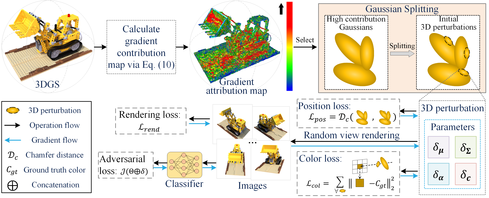

# Gaussian Splitting Attack: Gaussian Splatting-based Multi-View 3D Adversarial Attack


Abstract: *Existing multi-view adversarial attack methods utilize Neural Radiance Fields (NeRF) to generate adversarial samples from different viewpoints of an object effectively deceiving deep neural networks. However, these methods simply add noise to the rendered images and fail to construct explicit 3D adversarial samples limited by the implicit representation of NeRF.
To address the above limitation, we propose a novel Gaussian Splitting Attack (GSAttack) scheme based on Gaussian Splatting to generate explicit 3D adversarial samples that deceive the classifier in various viewpoints. Specifically, we first quantify the contribution of each Gaussian based on its gradient in adversarial attack. Subsequently, we split tiny Gaussians from the high contribution Gaussians as initial 3D perturbations, which are then optimized by adversarial loss to ensure deception in diverse viewpoints. Furthermore, to ensure the invisibility of 3D perturbation, we devise position and color losses to make the perturbations tightly bound to the object surface and minimize the color differences. Owing to these ingenious designs, our 3D perturbations are more natural in space and effective attack neural network.
Experimental results show that the 3D adversarial samples generated by our GSAttack can effectively deceive the classifier over a wider range of viewpoints and achieve superior visualization compared to existing schemes.*




## Environment
The computer we used to complete our experiments was an Ubuntu 20.04 system with NVIDIA GeForce RTX 2080Ti graphics cards.<br>
Some of the important packages and their versions are listed below.

| package     | version      |
|:------------|:-------------|
| CUDA        | 12.0         |
| python      | 3.8          |
| pytorch     | 2.0.1+cu118  |
| torchvision | 0.15.2+cu118 |

In addition, this project requires 3DGS training and rendering, so you need to install the packages mentioned in [3DGS](https://github.com/graphdeco-inria/gaussian-splatting.git).

## Data

We use the [dataset](https://github.com/bmild/nerf) presented in original NeRF paper which contains 8 objects.

## Running

### Training 3DGS model
The first step is to train the 3DGS model to reconstruct the scene that you want to attack.

```shell
python train.py -s <path to COLMAP or NeRF Synthetic dataset>
```

### Training and testing classification model
The second step is to train the classification model to achieve accurate classification.

```shell
python model_train.py --model_name resnet50 --num_classes 8 --data_dir <path to COLMAP or NeRF Synthetic dataset>
```

### Attack method
Run attack code.


```shell
python attack.py  -m <path to COLMAP or NeRF Synthetic dataset>  --source_gs <the source class name> --target_class 1
```

# Acknowledgement
This work is build upon 3DGS, many thanks to the 

* [NeRFail](https://github.com/jiang-wenxiang/NeRFail.git) 

and many other contributors. 

